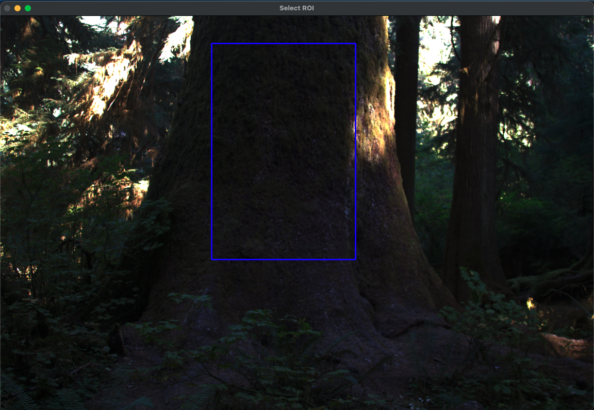
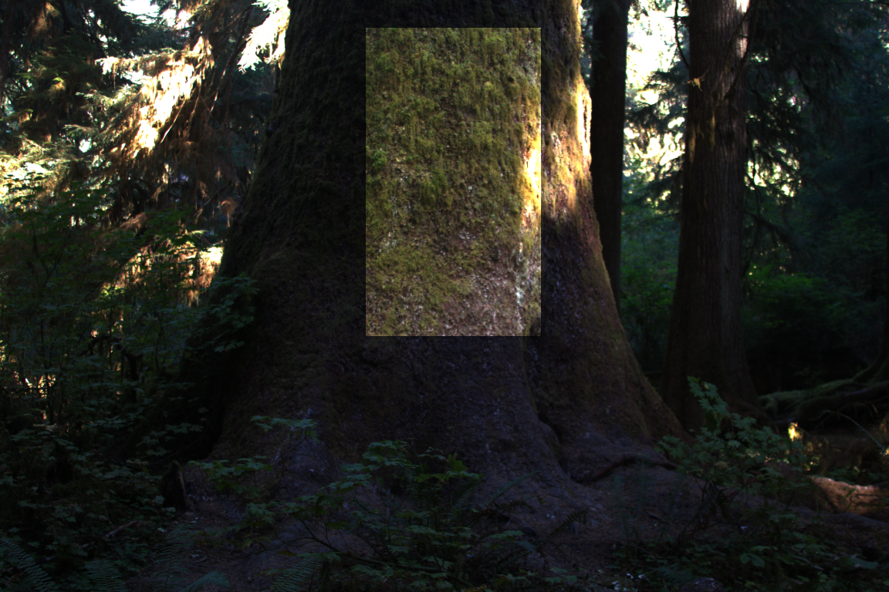
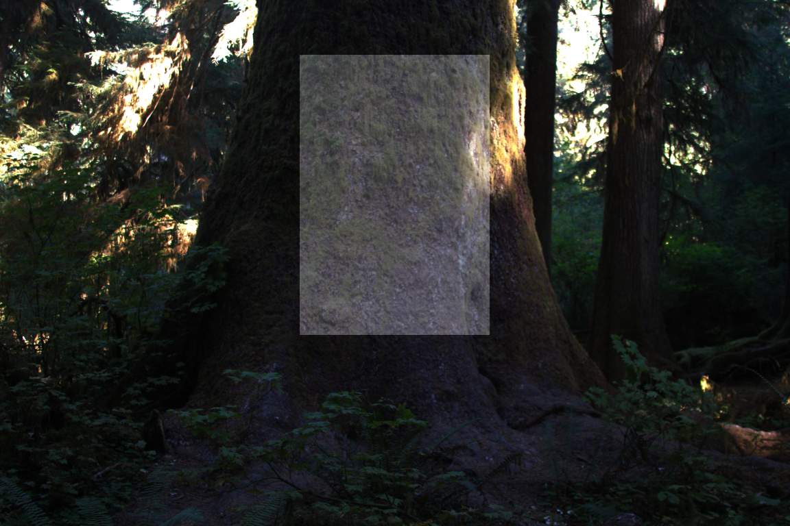

⸻

# ISD Shadow Correction Visualization

This script provides an interactive tool for comparing Illuminant Spectral Direction (ISD)-based shadow removal with traditional gamma correction techniques on linear RGB images. It includes functionality for loading images and ISD maps (either from disk or via model inference), selecting regions of interest (ROI), and visualizing the effect of pixel shifts along ISD vectors.

⸻

## Features
	• Visualize shadow correction using annotated or predicted ISD maps  
	• Interactive gamma correction viewer  
	• Interactive ISD shift viewer  
	• Model inference to predict ISD maps  
⸻

## Requirements
	•	Python 3.8+  
	•	OpenCV (v2)  
	•	PyTorch  
	•	NumPy  

## Install dependencies:

```bash
pip install opencv-python torch numpy
```

⸻

## Directory Structure
```bash
project_root/
|
├── data/                   # Contains example images and corresponding maps.
│   ├── images/
│   │   └── img.tif
│   └── sr_maps/
│        └── map.tiff
├── model/
│   └── models.py           # Contains spectral ratio map estimator models  
│   └── 'model_name'.pth    # Pretrained model checkpoint  
├── readme_pngs/            # Images for README
├── results/                # Contains results from both image correction methods.
├── run.py                  # The script.
```

⸻

## Usage

``` bash
python run.py [ARGS]
```
### Command-Line Arguments

| Argument             | Type   | Description                                                                 |
|----------------------|--------|-----------------------------------------------------------------------------|
| `--log-chroma`       | Flag   | Enables use of logarithmic chromaticity processing. **Default:** `False`.  |
| `--use-model`        | Flag   | Uses the trained model for inference instead of ground truth. **Default:** `False`. |
| `--show-gamma`       | Flag   | Displays gamma correction in addition to spectral ratio method. **Default:** `False`. |
| `--image <filename>` | String | Optionally specify the image name (without extension) to process. **Default:** `None`. |

```bash
python your_script.py --log-chroma --use-model --image example_image
```

## Core Components

`imgProcessor` (class)  
	•	Converting images between linear and log RGB.  
	•	Applying pixel shifts along ISD vectors.  
	•	Applying gamma correction.  
	•	Interactive OpenCV viewers.  
	•	Optional log-chromaticity projection.  

`ISDMapEstimator` (class)  
	•	Loads a pretrained model.  
	•	Converts input image to log space and normalizes.  
    •   Formats numpy ndarray image as Tensor suitable as model input.  
	•	Outputs normalized ISD map (unit vectors)  

⸻

## Interactive Viewers

1. interactive_shift_viewer()  
	•	Select ROI on the image using blue rectangle. Confirm selection with `ENTER` or reset with `c`.  
	•	Adjust a trackbar to shift pixels along their respective ISD vector.
    •   Close window with `ENTER`.  
	•	Saves the result as sr_correct_image.png.

2. interactive_gamma_viewer()  
	•	Select ROI on the image using blue rectangle. Confirm selection with `ENTER` or reset with `c`.  
	•	Adjust gamma value using a trackbar.
    •   Close window with `ENTER`.  
	•	Saves the result as gamma_corrected_result.png.


<p align="center">
  
</p>

⸻

## Sample Visualization Outputs  

### Original Image  

<p align="center">
  
</p>

### ISD-Shifted Result  

<p align="center">
  
</p>

### Gamma Corrected Result  

<p align="center">
  
</p>

⸻

## License

MIT License. © 2025 Michael Massone

⸻